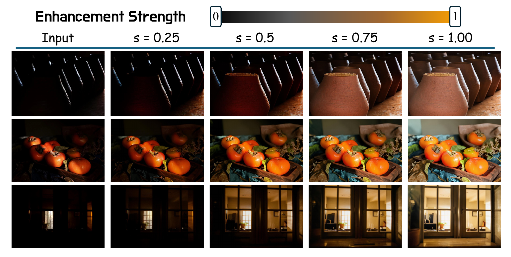

<div align="center">
  <h2><a href="https://arxiv.org/abs/2605.25569">ControlLight: Towards Controllable, Consistent, and Generalizable Low-Light Enhancement</a></h2>
  <p>
    <a href="https://yfyang007.github.io/ControlLight/"></a>
    <a href="https://huggingface.co/papers/2605.25569"></a>
    <a href="https://arxiv.org/abs/2605.25569"></a>
    <a href="https://huggingface.co/ControlLight/ControlLight"></a>
    <a href="https://huggingface.co/datasets/ControlLight/Light100K"></a>
    <a href="https://github.com/yfyang007/ControlLight"></a>
  </p>
</div>

<p align="center">
  
</p>

<p align="center">
  <video src="assets/controllight_homepage_hero_brightening_wechat.mp4" controls width="100%"></video>
</p>

## News

- [2026/05/25] We have released the [ControlLight model weights](https://huggingface.co/ControlLight/ControlLight) on Hugging Face.
- [2026/05/25] We have released [Light100K](https://huggingface.co/datasets/ControlLight/Light100K), a continuous low-light enhancement dataset for controllable illumination learning.
- [2026/05/25] We have released the ControlLight inference and training code.

## Note

ControlLight requires about 21 GB of VRAM for inference. Although the released model was trained with a fixed prompt setting, you can also try editing the prompt to explore additional light-control effects, such as color and atmosphere. We welcome broader experimentation.

## TODO

- [x] Open-source the inference scripts.
- [x] Open-source the training scripts.
- [x] Release Light100K on Hugging Face.
- [x] Open-source the ControlLight model weights.
- [ ] Release the bidirectional light-control model.

## Quick Start

### 1. Installation

This project relies on the patched local `diffusers/` checkout in this repository and uses a unified `controlight` environment for inference and training.

- Python: `3.12` is recommended.
- Base model: [black-forest-labs/FLUX.2-klein-base-9B](https://huggingface.co/black-forest-labs/FLUX.2-klein-base-9B).
- ControlLight LoRA: [ControlLight/ControlLight](https://huggingface.co/ControlLight/ControlLight).
- Dataset: [ControlLight/Light100K](https://huggingface.co/datasets/ControlLight/Light100K).

```bash
conda create -n controlight python=3.12 -y
conda activate controlight

python -m pip install --upgrade pip
python -m pip install -e diffusers
python -m pip install -r requirements.txt
python -m pip install -e .
```

You can verify the environment with:

```bash
bash scripts/predict.sh --help
bash scripts/demo.sh --help
bash -lc 'source scripts/project_env.sh; python run.py --help >/dev/null'
```

### 2. Prepare Models

Download or place the required model assets under `models/` or provide explicit paths through command-line arguments.

```text
models/
  FLUX.2-klein-base-9B/      # FLUX.2 [klein] 9B base model
  controllight.safetensors   # ControlLight LoRA checkpoint
  flux2_vae/ae.safetensors   # VAE path used by the training config, if needed
```

The default public training config uses `./models/FLUX.2-klein-base-9B`. You can also pass:

```bash
--model-path /path/to/FLUX.2-klein-base-9B
--lora-path /path/to/controllight.safetensors
```

### 3. Recommended Inference Config

- Device: `cuda`
- Torch dtype: `bfloat16`
- Inference steps: `20`
- Guidance scale: `1.0`
- Recommended seed: `42`
- Enhancement strength: `alpha` in `[0, 1]`, where larger values produce stronger low-light enhancement.

## ControlLight Inference

### Single Image

```bash
bash scripts/predict.sh predict-image \
  --input /path/to/input.jpg \
  --output /path/to/output.png \
  --model-path /path/to/FLUX.2-klein-base-9B \
  --lora-path /path/to/controllight.safetensors \
  --alpha 0.50 \
  --num-inference-steps 20 \
  --guidance-scale 1.0 \
  --seed 42 \
  --device cuda \
  --torch-dtype bfloat16
```

### Four-Strength Sweep

The public sweep generates controllable enhancement results at `0.25`, `0.50`, `0.75`, and `1.00`.

```bash
bash scripts/predict.sh predict-four \
  --input /path/to/images \
  --output /path/to/out_four \
  --model-path /path/to/FLUX.2-klein-base-9B \
  --lora-path /path/to/controllight.safetensors \
  --num-inference-steps 20 \
  --seed 42 \
  --device cuda \
  --torch-dtype bfloat16
```

### Custom Strength Sweep

```bash
bash scripts/predict.sh predict-strengths \
  --input /path/to/images \
  --output /path/to/out_strengths \
  --model-path /path/to/FLUX.2-klein-base-9B \
  --lora-path /path/to/controllight.safetensors \
  --alphas 0.20,0.40,0.60,0.80 \
  --num-inference-steps 20 \
  --seed 42 \
  --device cuda \
  --torch-dtype bfloat16
```

`predict-four` and `predict-strengths` accept either a plain image directory or a `design_materials` root containing `sources/`.

The batch output contains:

```text
manifest.json
sources/<slug>.png
results/<slug>/input.jpg
results/<slug>/grid.jpg
results/<slug>/comparison.gif
results/<slug>/outputs/*.png
results/<slug>/metadata.json
```

## Local Demo

```bash
bash scripts/demo.sh \
  --host 0.0.0.0 \
  --port 7860 \
  --model-path /path/to/FLUX.2-klein-base-9B \
  --lora-path /path/to/controllight.safetensors \
  --device cuda \
  --torch-dtype bfloat16
```

## Training

ControlLight is trained as a LoRA on top of FLUX.2 [klein] 9B with continuous low-light enhancement supervision from Light100K.

### Dataset Configuration

Download [Light100K](https://huggingface.co/datasets/ControlLight/Light100K) and organize the training subset according to the paths used by `config/train_flux2klein_lora.yaml`.

The default config expects:

```text
datasets/flux2klein_alpha_interp5_20260501_unified_edgeexp/
  control/
  mask_normrgb_l01/
  mask_normrgb_l02/
  mask_normrgb_l03/
  mask_normrgb_l04/
  mask_normrgb_l05/
  target_l01/
  target_l02/
  target_l03/
  target_l04/
  target_l05/
```

Each `target_lXX` folder corresponds to one enhancement level. The training config maps these levels to LoRA network weights from `0.2` to `1.0`, while `control/` stores the original low-light inputs and `mask_normrgb_lXX/` stores the corresponding light-control masks.

If your dataset root differs, duplicate `config/train_flux2klein_lora.yaml` and update `folder_path`, `control_path`, and `mask_path`.

### Training Scripts

Main config:

- `config/train_flux2klein_lora.yaml`

Public training entrypoints:

- `scripts/train/train_local.sh`
- `scripts/train/train_multigpu.sh`
- `scripts/train/train_watchdog.sh`

Local or default multi-GPU launch:

```bash
bash scripts/train/train_local.sh
```

Explicit distributed launch:

```bash
CONFIG=./config/train_flux2klein_lora.yaml \
GPUS=0,1,2,3 \
NUM_PROCESSES=4 \
MAIN_PROCESS_PORT=30000 \
bash scripts/train/train_multigpu.sh
```

Keep training alive with automatic resume:

```bash
bash scripts/train/train_watchdog.sh
```

Useful overrides:

```bash
RUN_NAME=my_controllight_run \
CONFIG=./config/train_flux2klein_lora.yaml \
CUDA_VISIBLE_DEVICES=0,1,2,3 \
NUM_PROCESSES=4 \
CONDA_ENV=controlight \
bash scripts/train/train_local.sh
```

More details are available in [`scripts/train/README.md`](scripts/train/README.md).

## Repository Layout

```text
ControlLight/           Python package and public CLIs
config/                 Public training config
diffusers/              Vendored local diffusers checkout
docs/                   Installation notes
extensions/             Training extensions used by the stack
extensions_built_in/    Built-in model and trainer integrations
jobs/                   Training job launcher code
scripts/                Public shell entrypoints
toolkit/                Core training and inference helpers
predict.py              Public prediction entrypoint
serve_demo.py           Public local demo entrypoint
run.py                  Training launcher
```

## Citation

If you find ControlLight useful in your research, please star and cite:

```bibtex
@misc{yang2026controllightcontrollableconsistentgeneralizable,
      title={ControlLight: Towards Controllable, Consistent, and Generalizable Low-Light Enhancement}, 
      author={Yufeng Yang and Jianzhuang Liu and Jisheng Chu and Yuqi Peng and Xianfang Zeng and Jiancheng Huang and Shifeng Chen},
      year={2026},
      eprint={2605.25569},
      archivePrefix={arXiv},
      primaryClass={cs.CV},
      url={https://arxiv.org/abs/2605.25569}, 
}
```
